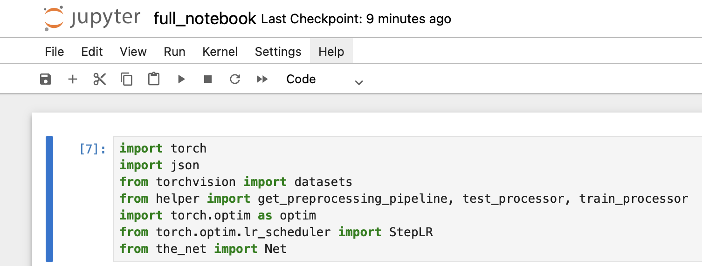
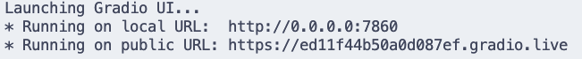
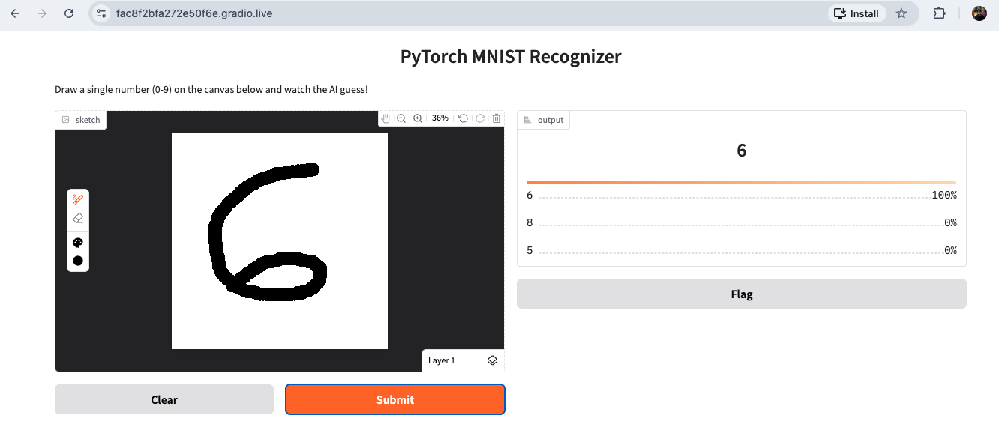

# AI on the Cloud
The repository that contains all the programms used in the RACCETCON pre-conference workshops.

## Directory Structure
```
src
├── app.py
├── config.json
├── for_workshop.ipynb
├── full_notebook.ipynb
├── get_from_bucket.py
├── helper.py
├── mnist_cnn.pt
├── requirements.txt
├── the_net.py
└── write_to_bucket.py
```

### app.py
The script that loads the model weights and launches the gradio UI.

### config.json
Not used in any script. But compiled for reference.

### for_workshop.ipynb
The notebook that was used in the workshop

### full_notebook.ipynb
The full notebook with train, testing, and saving the weights.

### helper.py
Helper functions with the train and test loaders.

### requirements.txt
requirements file used to install the packages with `pip install -r requirements.txt`

### the_net.py
The neural network defined with Pytorch.

### write_to_bucket.py
saves the weights to the Google Cloud bucket.

### get_from_bucket.py
retrieves the weight from the Google Cloud bucket.

## Deployment Process
**1. Install Required Packages**
```bash
pip install -r requirements.txt
```
**2. Run Notebook**
Click on the  button.


Once model training is finished, a new file called `mnist_cnn.pt` should be in the same folder as the notebook.


**3. Deployment Finalization**

Finally, run the `app.py` script with:
```bash
python3 app.py
```

This should what your terminal would show. 



Just copy the *public url* and paste it into your browser. 

This should be the final output:



## References

1. L. Deng, "The MNIST Database of Handwritten Digit Images for Machine Learning Research [Best of the Web]," in IEEE Signal Processing Magazine, vol. 29, no. 6, pp. 141-142, Nov. 2012, doi: 10.1109/MSP.2012.2211477.
keywords: {Machine learning}


2. Official Pytorch MNIST Example: [link](https://github.com/pytorch/examples/tree/main/mnist)